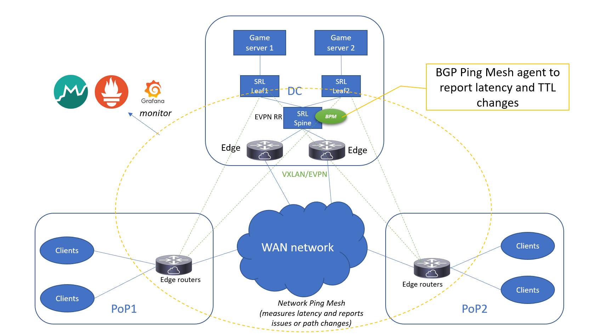

# bgp-ping-mesh
An agent that measures and reports BGP peering keep-alive RTT/TTL metrics based on observed keep-alive packets.


# Concept
Consider a globally distributed network with various sites, for example as described by [Roblox Engineering](https://blog.roblox.com/2021/04/network-packet-loss-latency-monitoring-roblox-cloud/). There is a general need to monitor latency and path changes between sites, and while you can do that by deploying agents on generic servers, why not simply report on traffic that is already traversing the network?

Given a truly open NOS like SR Linux, we can add whatever monitoring or reporting we want. For example: BGP keep-alive packets

# BGP keep-alive
By default, BGP peers exchange keep-alive packets every 30s to ensure the peer remains reachable. These small TCP packets are a stable stream of potential network observations, providing insight into changes in the network paths between peers. If the peers are located across a wide area network (say: BGP between PoP locations and central data centers), this traffic can serve as the proverbial "canary" 🐥 to detect potential issues.

The resulting telemetry can be subscribed to, reported on a dashboard, etc.


```
[linuxadmin@srl1 ~]$ ip netns exec srbase-default tcpdump -i any -nnve tcp port 179 -c 4
tcpdump: data link type LINUX_SLL2
tcpdump: listening on any, link-type LINUX_SLL2 (Linux cooked v2), snapshot length 262144 bytes
00:06:57.841133 e1-1.0 In  ifindex 4 02:88:ec:ff:00:01 ethertype IPv4 (0x0800), length 91: (tos 0xc0, ttl 64, id 3230, offset 0, flags [DF], proto TCP (6), length 71)
    1.1.1.2.179 > 1.1.1.1.44235: Flags [P.], cksum 0x760e (correct), seq 3770217231:3770217250, ack 127478768, win 31290, options [nop,nop,TS val 3173587590 ecr 3221762489], length 19: BGP
	Keepalive Message (4), length: 19
00:06:57.841195 gateway Out ifindex 2 02:a6:c5:ff:00:00 ethertype IPv4 (0x0800), length 72: (tos 0xc0, ttl 64, id 24967, offset 0, flags [DF], proto TCP (6), length 52)
    1.1.1.1.44235 > 1.1.1.2.179: Flags [.], cksum 0x41d6 (correct), ack 19, win 31746, options [nop,nop,TS val 3221776452 ecr 3173587590], length 0
00:07:11.931061 gateway Out ifindex 2 02:a6:c5:ff:00:00 ethertype IPv4 (0x0800), length 91: (tos 0xc0, ttl 64, id 24968, offset 0, flags [DF], proto TCP (6), length 71)
    1.1.1.1.44235 > 1.1.1.2.179: Flags [P.], cksum 0x069e (correct), seq 1:20, ack 19, win 31746, options [nop,nop,TS val 3221790542 ecr 3173587590], length 19: BGP
	Keepalive Message (4), length: 19
00:07:11.945106 e1-1.0 In  ifindex 4 02:88:ec:ff:00:01 ethertype IPv4 (0x0800), length 72: (tos 0xc0, ttl 64, id 3231, offset 0, flags [DF], proto TCP (6), length 52)
    1.1.1.2.179 > 1.1.1.1.44235: Flags [.], cksum 0xd562 (correct), ack 20, win 31290, options [nop,nop,TS val 3173601700 ecr 3221790542], length 0
4 packets captured
4 packets received by filter
0 packets dropped by kernel
```
A simple tcpdump illustrates what we can leverage - note the TCP timestamp option, the ttl field

## Python scapy
The Python [scapy](https://scapy.net/) library is a small packet processing tool to capture packets based on bpf filters.
In order to capture BGP keep-alive packets, we can use 'sniff':
```
from scapy.all import sniff
sniff(iface=["gateway","e1-1.0","e1-2.0"], filter="tcp port 179", prn=handle_bgp_keepalive, store=False)
```
Additional filtering options (like specific packet sizes) could be added, but basically this is all it takes to collect data to calculate and report rtt latencies.
Note that the prototype uses the latest version from Github (due to some issue with specifying multiple interfaces for 'sniff', fixed but not yet included in the latest release)

## eBPF filter
Under the hood, this prototype uses [eBPF](https://github.com/jbemmel/srl-ping-mesh/blob/main/src/bgp-ping-mesh/bgp-keepalive-filter.c) to forward BGP packets received by the CPM to a custom Python application for analysis. Note that this works because BGP packets go to the CPU, it would not work for general packets.

The demo only lists active interfaces in the 'default' network-instance, this could be generalized
